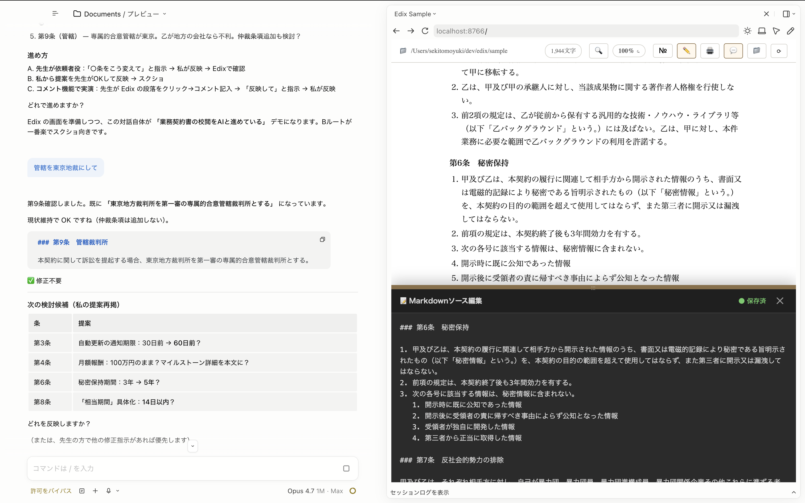
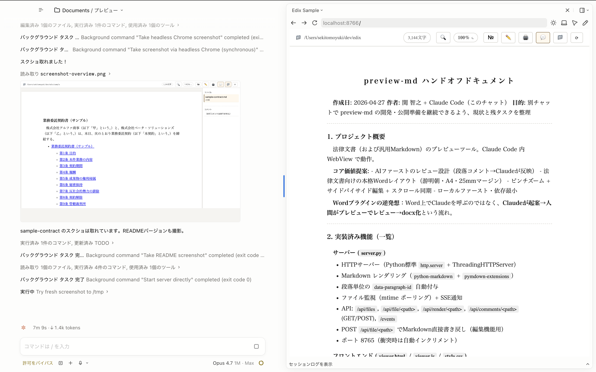
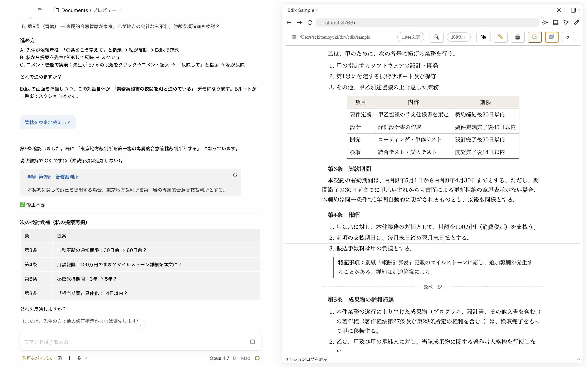

# Edix

> **1画面で全部完結する、AIネイティブ・ドキュメントエディタ**
> プレビュー／編集／コメント／AI反映 — ウィンドウ切替なしで完結する。



左がAIチャット、右上がA4プレビュー、右下がMarkdownソースエディタ。
**この1画面の中で、起案 → レビュー → 修正指示 → 反映 → 再確認まで完結する。**

**従来**：Wordを開く → 別ウィンドウでAIに質問 → コピペで戻る …  
**Edix**：プレビューで読む → 段落クリックでコメント → AIに「反映して」 → 即リロード

ウィンドウ／タブ／ツールを行き来する必要なし。

---

### スクリーンショット

| 全体ビュー | 契約書レビュー | プレビュー＋編集 |
|---|---|---|
|  |  |  |
| ファイル一覧・コメント・更新日 | AIに「○条をこう変えて」と指示 | 下からスライドアップする編集ペイン |

## ⚡ Quick Start

```bash
git clone https://github.com/yutoribengoshi/edix.git ~/dev/edix
pip install markdown pymdown-extensions
python3 ~/dev/edix/server.py [target_dir]    # → http://localhost:8765/
```

## 🎯 Use Cases

契約レビュー ・ 論文推敲 ・ 翻訳対比 ・ 仕様書 ・ 法律文書 ・ **AIに見せながら一緒に書きたい全員**

## ✨ 1画面に詰まっている機能

| 領域 | できること |
|---|---|
| 📄 プレビュー | A4 Word レイアウト・游明朝・ピンチズーム |
| 💬 コメント | 段落クリック→ポップアップ→保存→AI反映 |
| 📝 編集 | 下部スライドアップ・スクロール同期・自動保存 |
| 🔍 検索 | Cmd+F 全マッチハイライト |
| 🖨 印刷 | A4・ページ番号・UI非表示 |
| 📚 拡張記法 | 目次 `[TOC]` ／ 改ページ ／ 自動連番 |
| 📁 サイドバー | ファイル一覧・更新日・コメントバッジ |

すべて画面切替なし。コメントしたら、AIに「反映して」と頼むだけ。

<details>
<summary>📖 詳細を開く</summary>

### 起動方法
- **スキル**: `/preview-md [target_dir]`（将来 `/edix` にリネーム予定）
- **ターミナル**: `lglmd [target_dir]` または `python3 server.py [dir]`
- **Claude Code WebView**: `.claude/launch.json` 経由で `preview_start "Edix"`

### キーボードショートカット
| キー | 動作 |
|---|---|
| `Cmd+F` | 検索 |
| `Cmd+ +/-/0` | 拡大/縮小/100%リセット |
| `Cmd+S` | 編集中の即時保存 |
| `Esc` | ポップアップ/検索/編集を順に閉じる |
| `Enter / Shift+Enter` | 検索：次へ/前へ |
| `2本指ピンチ` | プレビューを拡大縮小 |

### Markdown 独自記法
| 記法 | 効果 |
|---|---|
| `[TOC]` | 目次自動生成 |
| `<!--page-break-->` / `---page---` | 強制改ページ（印刷時） |
| `項目【】` | 自動連番（`項目１, 項目２, ...`） |
| `№` ボタン（オプション） | 見出しに岡口マクロ風自動番号（第１/１/(１)/ア） |

### コメント反映フロー
1. プレビューの段落をクリック → 💬 → コメント入力
2. `<file>.md.comments.json` に保存
3. AI に「**コメント反映して**」と指示
4. AI が `comments.json` を読んで Markdown を Edit
5. SSE 経由でブラウザ自動リロード
6. status を pending → applied に更新

### 設計コンセプト
- **1画面で完結**：プレビュー・編集・コメント・AI反映を切替なしで
- **AI ファースト**：人がPDFで読むのではなく、AI に修正させることが前提
- **ローカルファースト**：ファイルは手元、git 管理しやすい
- **軽量**：Python 標準 + `markdown` 1個・5 分でインストール
- **CSS zoom 方式**：レイアウト含めて縮小（中央寄せが正しく効く）

### 既存ツールとの比較
| ツール | 1画面で完結する？ |
|---|---|
| Word + AI プラグイン | × プラグイン経由・別ウィンドウ |
| Notion AI | △ 記法独自・ローカル外管理 |
| VSCode + Markdown Preview | × コメント機能なし |
| Typora / Obsidian | × AI連携なし |
| **Edix** | **○ 全部1画面** |

### ロードマップ
- v0.1 ✅ プレビュー・コメント・編集・検索・印刷・拡張記法
- v0.2 — スキル名 `edix` リネーム / PyPI / README英訳 / 公開検討
- v0.3 — MCP化 / PDF出力 / 縦書き / 比較ビュー / 共同編集

</details>

## 🛠 Stack

Python 3.9+ / [`markdown`](https://python-markdown.github.io/) / [`pymdown-extensions`](https://facelessuser.github.io/pymdown-extensions/) / 標準HTML/CSS/JS

## 📜 License & Author

未定（MIT予定） / [@yutoribengoshi](https://github.com/yutoribengoshi) + Claude Code
